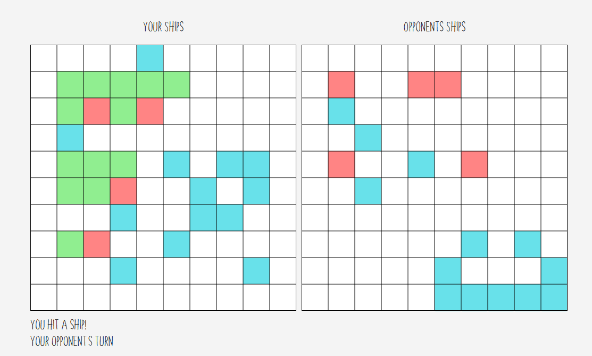
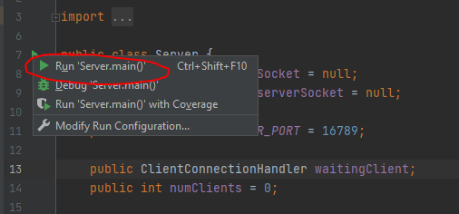
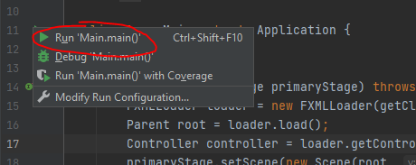
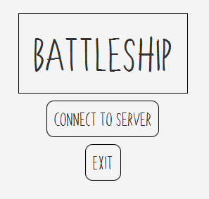
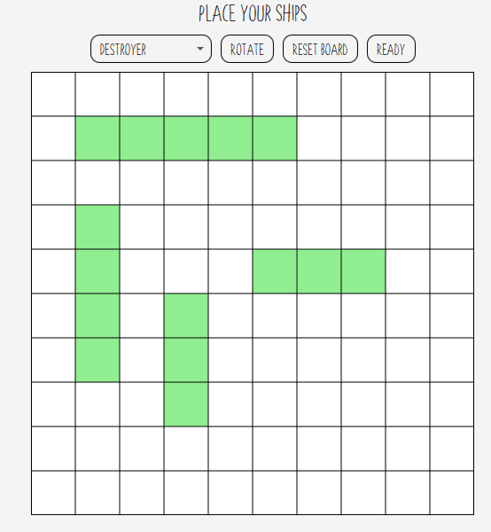
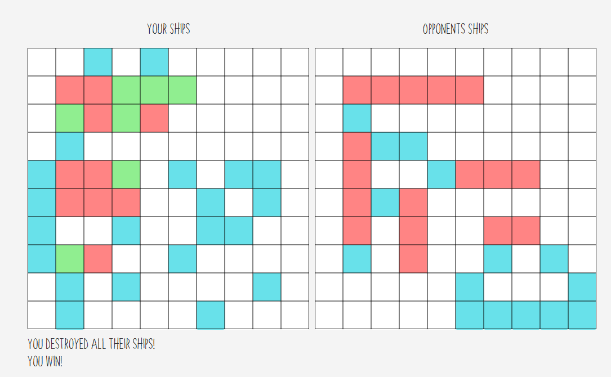

# Battleship
Battleship is a game where you and a friend launch missiles at eachother's ships until only one person has ships still floating!
## Table of Contents
- [Project Information](#project-information)
- [How to Run](#how-to-run)
	- [Download and Setup](#download-and-setup)
	- [Navigating the Program](#navigating-the-program)
- [Other Resources](#other-resources)
## Project Information
Battleship is a `2 player game` where you and the competitor (enemy) both have multiple ships. You can place the ships anywhere on your grid you want (assuming it does not collide with one of your other ships). You and your competitor will then take turns firing missiles at the other person's grid without knowing where their ships are. When you fire it will let you know if you hit a ship or not and you can use that information to better estimate where the rest of that ship or the other ships are. The game will continue until only one player has ships remaining. The winner will the player who has ship(s) still standing!

## How to Run
These instructions on how to run the program assume that you already have the required Java and JavaFX downloads. While it is also possible to run this via the command line or other development environments; these instructions will use intelliJ.
### Download and Setup
* To download the intelliJ project from github go into command line/command prompt and clone the repository: `git clone https://github.com/adam-adamczyk/2020GroupAssignment`
* Open the downloaded project in intelliJ
#### Server
* Run the Server, this can be done by clicking the green arrow in `Server.java` followed by clicking `Run 'Server.main()'`
 

#### Client
* Run the Client using the same process but in `main.java` and click `Run 'Main.main()'`

##### Troubleshooting: If you want to run both players (clients) on the same machine
If you can only run the client one at a time follow these steps.
* Click on the `configuration selector` at the top right it can be found to the right of the `Build Project` button that looks like a green hammer.
* Click `Edit Configurations...`
* In the `Application` section on the left select `Main`
* Under `Build and run` click `Modify options` and enable `Allow multiple instances`
* Click `Apply`
* Click `Ok`
* Repeat the Run the Client step for both of the required clients

### Navigating the Program / How to Play
This section will only cover the client. Once the server is running nothing has to be done on the server's end anymore.
* Upon launching the game you will be greeted to the main menu. Over here you can exit or connect to the server. In order to play the game you should click `Connect to Server`

At this point after both players connect to the server, you will be able to place your ships. You have the following options:
* `Select a Ship` Using the drop down menu, you can manually select which ship to place
* `Rotate` You can rotate the current ship 90 degrees
* `Reset Board` You can remove all currently placed ships and start over
* `Ready` Upon placing all 5 ships you can ready up and once the other player does, the game will start.
To place your ships simply `hover your mouse` over where you would like to and you will see a preview of what the ship will look like when placed. Just `right click the mouse` to place it down

After both players click `ready` the game will start. You can tell whos turn it is via the text on the bottom left of the game. This text will also let you know if your missile hit a ship or not and who won the game once it is over.
Here is some important info:

#### Your Side (Left)
* `Green squares` on your grid refer to remaining parts of your ships that have not been hit by the opponent
* `Red squares` on your grid refer to parts of your ship that the opponent has hit
* `Blue squares` on your grid refer to parts of the grid that the opponent has launched a missile at that have NOT been your ships
* `White squares` on your grid refer to parts of the grid that your opponent has NOT launched a missile at and your ships do NOT occupy
#### Opponents Side (Right)
* `Red squares` on your opponent's grid refer to parts that you have launched a missile at and there is a ship.
* `Blue squares` on your opponent's grid refer to parts you have launched a missile and no ship is at.
* `White squares` on the opponent's grid refer to parts that you have not launched a missile at. They are spots where a ship may or may not be.

To launch a missile on your turn simply press the square you want to fire one at on your opponent's grid.

Upon one player's ships all sinking the winner will be notified in the bottom left. The loser will also recieve a losing message. At this point both player's should close their game windows.

## Other Resources
Placeholder